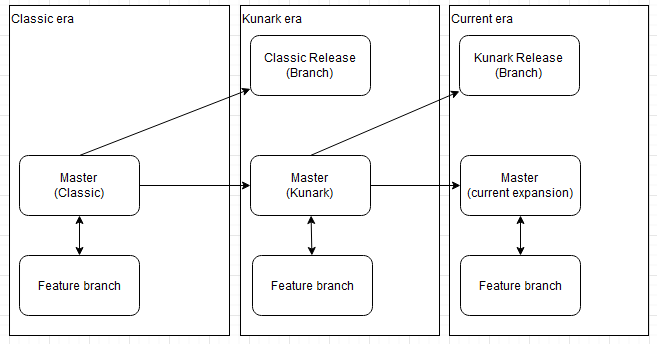
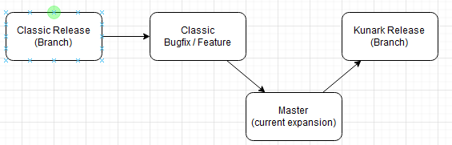

# Development
Master is always current expansion, but when we start work on next (or release) we branch out a "release" version

## Tools
We recommend GitHub desktop to handle Git sourcecontrol unless you are very familiar with git commands or other tools to handle git.

Visual Studio is the recommended code writing tool.

### GitHub Desktop
Available [here](https://desktop.github.com/).

Clone the repository through menu path (or ctrl+ shft + O )
* File
  * Clone repository.. 

When wanting to contribute or make changes.
* Click the menu tab "Current branch"
* Click the "New branch" button
* Make sure "master" is selected as the branch to create from if you want to contribute to current expansion, if not select the branch for the given expansion you want to contribute too
* Use a name standard "master-feature-or-bug-name" (prefix the name with name of the branch you are contributing too)
* Make changes
* Commit changes
* Push changes to github
* Use GitHub Desktop or web to create pull request back to the branch you wanted to contribute too (master or expansion release branch)

#### Advanced
When making changes to release branches, we probably want to brings those changes forward to the master and possibly other relase branches as well. Start with manually merging the release changes to the master branch. Then manually merge those changes to each release branch that requires these changes.

### Visual Studio Code
Available [here](https://code.visualstudio.com/download).